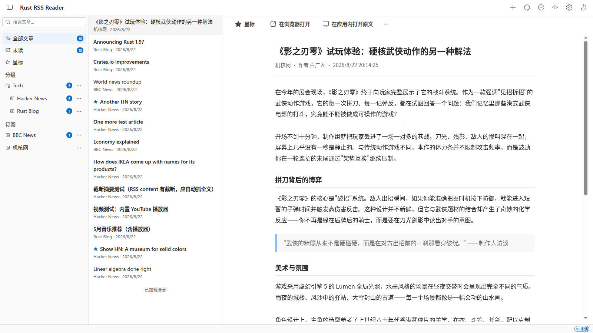

<p align="center"><pre>
████╗ ████╗ ████╗
██╔═╝ ██╔═╝ ██╔═╝
████╗ ████╗ ████╗
╚═██╗ ╚═██╗ ╚═██╗
████╝ ████╝ ████╝
</pre></p>
<h3 align="center">Rust RSS Reader</h3>
<p align="center">用 Rust 复刻 <a href="https://github.com/yang991178/fluent-reader">Fluent Reader</a> 的 RSS 阅读器 · A Fluent Reader-inspired RSS reader written in Rust</p>
<p align="center">
  
  
  
  
</p>
<hr />

**状态 / Status**：桌面端功能较完整，持续迭代中；终端版（TUI）仍在完善，功能落后于桌面端。
Desktop client is feature-complete and actively iterated; the terminal (TUI) client is still WIP and lags behind.

<p align="center">
  
  <br/>
  <sub>阅读区 / Reader</sub>
</p>

---

## 中文

### 简介

一个共享核心引擎、双前端（Tauri 桌面端 + ratatui 终端）的 RSS 阅读器，模仿 Fluent Reader 的 Fluent Design 风格。

### 功能特性

**订阅管理**
- 添加 / 删除订阅源，文件夹分组，重命名，修改源 URL
- 全局 / 每源刷新间隔，每源「走代理」开关，每源「默认应用内打开原文」
- OPML 2.0 导入（递归 + 错误报告）/ 导出

**文章**
- 已读 / 未读 / 星标，搜索（标题 / 摘要 / 正文），排序（时间 / 未读 / 星标 / 标题），分页加载
- 四种视图：列表 / 紧凑 / 卡片 / 杂志
- 打开文章自动抓取全文（readability + 正文容器提取 + 站点适配器），抓取期间阅读区转圈等待，就绪后一次性呈现

**抓取与反爬**
- 浏览器 UA + 同域 Referer（应对 CSDN 等反爬站）
- 图片代理：防盗链 Referer、相对路径补全、磁盘缓存
- 站点适配器注册表：新增站点 = 一个文件 + 一行注册（已内置 gcores）
- 增量刷新（ETag / Last-Modified / 304）

**阅读体验**
- 字号调节，Markdown / HTML / PDF / TXT 导出，复制 Markdown
- 应用内打开原文（iframe 内嵌 / 独立窗口，X-Frame-Options 检测）
- 媒体播放弹窗：YouTube / B 站 / 网易云 / Apple Music / Spotify 等
- 暗黑 / 浅色 / 跟随系统主题，中文 / English 界面

**桌面端工程**
- 自定义无边框标题栏（拖拽 + 边缘 resize）
- 代理设置（http / https / socks5），数据目录迁移，一键清缓存
- 统一日志系统：前后端日志写入同一份 `logs/app.log`（`RUST_LOG` 可调级别），每个命令记录参数与结果，方便排障

### 技术栈

| 层 | 技术 |
|----|------|
| 核心引擎（`crates/rss-core`） | Rust、feed-rs（RSS/Atom 解析）、rusqlite（bundled SQLite）、reqwest（rustls / gzip / brotli / socks）、readability、scraper、quick-xml、html2md、tracing |
| 桌面端（`apps/desktop`） | Tauri v2（custom-protocol）、tauri-plugin-opener / dialog、tracing-subscriber / appender |
| 桌面前端（`apps/desktop/ui`） | React、TypeScript、Vite、Fluent UI React 9、@tauri-apps/api |
| 终端版（`apps/tui`） | ratatui、crossterm |

### 架构

```
rss-reader/                  # cargo workspace
├── crates/rss-core/         # 共享 RSS 引擎（纯 Rust，无 UI）
│   ├── src/lib.rs           #   RssReader 门面（add_feed / refresh / backfill / fetch_article）
│   ├── src/feed.rs          #   抓取编排（readability → 容器 → adapter 兜底 + CF 检测）
│   ├── src/fetch/           #   generic 通用抓取 + adapters 站点适配器注册表
│   ├── src/image.rs         #   图片代理 + 磁盘缓存
│   ├── src/storage.rs       #   SQLite 持久化（Mutex 线程安全）
│   ├── src/opml.rs          #   OPML 导入 / 导出
│   └── src/tests.rs         #   单元测试 + 网络集成测试（#[ignore]）
├── apps/tui/                # 终端客户端（ratatui）
└── apps/desktop/            # 桌面客户端（Tauri v2）
    ├── src/lib.rs           #   命令层（invoke_handler）+ 日志初始化
    └── ui/                  #   React + TS + Fluent UI React 9（Vite）
```

数据流：`前端 api.ts → Tauri invoke（camelCase 参数）→ 命令层 → rss-core 引擎 → SQLite`

### 构建与运行

```bash
# 桌面端（含前端构建）
./run-desktop.sh
# 或分步
npm --prefix apps/desktop/ui run build
cargo run -p rss-desktop

# 终端版（仍在完善）
cargo run -p rss-tui        # 快捷键：?

# 测试
cargo test --workspace
# 真实网络抓取集成测试（默认忽略，手动跑）
cargo test -p rss-core network_ -- --ignored --nocapture
```

打包 deb：`cd apps/desktop && ui/node_modules/.bin/tauri build --bundles deb`

### 数据目录

- 数据库：`~/.local/share/rss-reader/rss.db`（其他平台遵循 `dirs` 约定；设置页可自定义数据目录并迁移）
- 图片缓存：`{data_dir}/img_cache/`
- 日志：`{data_dir}/logs/app.log`

### 致谢 / 模仿

- 界面与交互模仿 [Fluent Reader](https://github.com/yang991178/fluent-reader)，使用微软 [Fluent UI React 9](https://react.fluentui.dev/) 组件库
- 全文抓取基于 [readability](https://crates.io/crates/readability)

### License

[MIT](LICENSE)

---

## English

### Overview

An RSS reader with a shared Rust core and two frontends (Tauri desktop + ratatui terminal), inspired by Fluent Reader's Fluent Design.

### Features

- Subscription management: add/remove feeds, folder grouping, rename, URL edit, per-feed refresh interval / proxy / default-open-original
- OPML 2.0 import (recursive + error report) / export
- Articles: read/unread/star, search, sorting, paging, four view modes (list / compact / card / magazine)
- Auto-fetch full text on open (readability + content container + site adapters); reader area spins until content is ready, then renders once
- Anti-bot: browser UA + same-origin Referer; image proxy with anti-hotlink Referer, relative-path resolution, disk cache
- Site adapter registry: add a site = one file + one registration line (gcores built-in)
- Incremental refresh via ETag / Last-Modified / 304
- Reader: font-size, export Markdown/HTML/PDF/TXT, copy, in-app original view (iframe / separate window, X-Frame-Options detection), media dialog (YouTube / Bilibili / NetEase / Apple Music / Spotify...)
- Dark / light / system theme, zh-CN / en UI
- Custom borderless title bar (drag + edge resize), proxy (http/https/socks5), data-dir migration, cache clear
- Unified logging: frontend + backend write to `logs/app.log` (`RUST_LOG` adjustable), every command logs args & result

### Tech Stack

Core: Rust, feed-rs, rusqlite (bundled), reqwest (rustls/gzip/brotli/socks), readability, scraper, quick-xml, html2md, tracing
Desktop: Tauri v2 (custom-protocol), tauri-plugin-opener/dialog, tracing-subscriber/appender
Desktop UI: React, TypeScript, Vite, Fluent UI React 9
TUI: ratatui, crossterm

### Build & Run

```bash
./run-desktop.sh                       # desktop (builds frontend + runs)
cargo run -p rss-tui                   # terminal (WIP)
cargo test --workspace                 # tests
cd apps/desktop && ui/node_modules/.bin/tauri build --bundles deb
```

### Data

- DB: `~/.local/share/rss-reader/rss.db` (customizable in Settings)
- Image cache: `{data_dir}/img_cache/`; Logs: `{data_dir}/logs/app.log`

### Credit

UI/UX inspired by [Fluent Reader](https://github.com/yang991178/fluent-reader), built on [Fluent UI React 9](https://react.fluentui.dev/); full-text extraction based on [readability](https://crates.io/crates/readability).

### License

[MIT](LICENSE)
